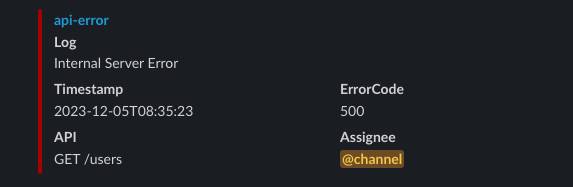
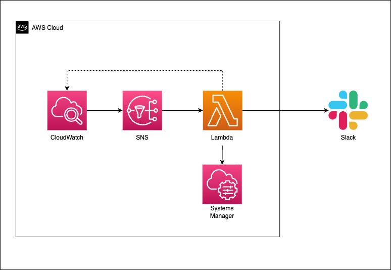

# Notify CloudWatch Error Log to Slack

This is a Lambda function to notify CloudWatch error log to Slack.

Sample message is as follows.



# Architecture



See more details in [Qiita](https://qiita.com/Jiei-S/items/082c66fe13e2ed3c2729).

# How To Development

## Setup

You need to execute the following steps.

- Create `~/.aws/credentials` and set credentials as default.
- Set following environment variables in AWS Systems Manager Parameter Store.
  - `SLACK_TOKEN`
  - `SLACK_CHANNEL`
  - `SLACK_SIGNING_SECRET`

## Run

```bash
$ make dev
```

## Test the Lambda function locally

Run the following command to invoke the Lambda function locally.

```bash
curl "http://localhost:8080/2015-03-31/functions/function/invocations" -d '{}'
```

See more details in [Using AWS Lambda with Amazon SNS](https://docs.aws.amazon.com/lambda/latest/dg/with-sns.html).
